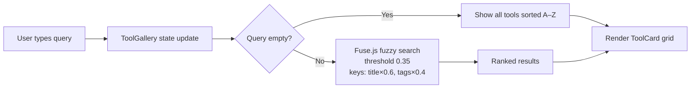
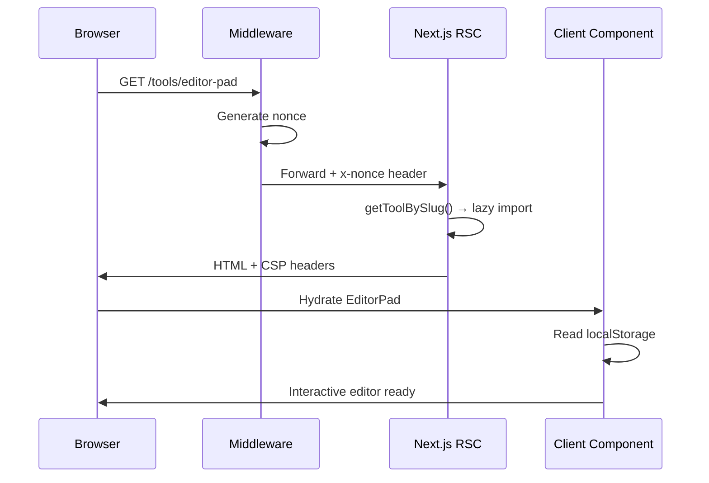
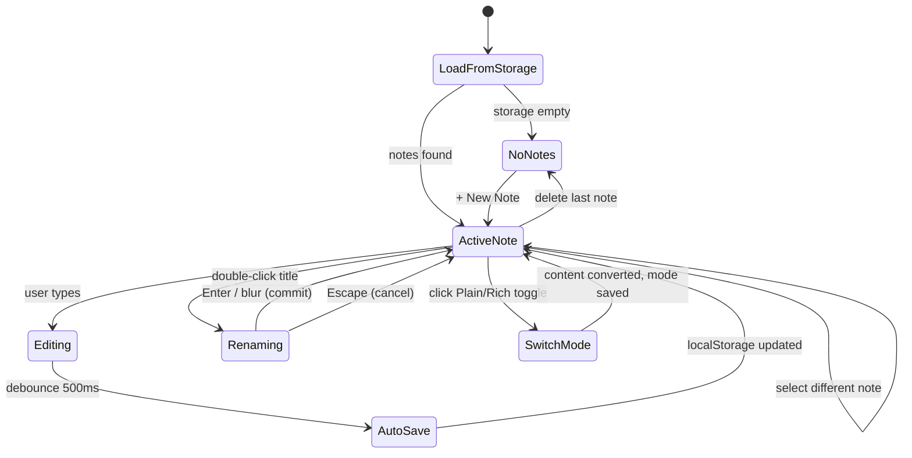
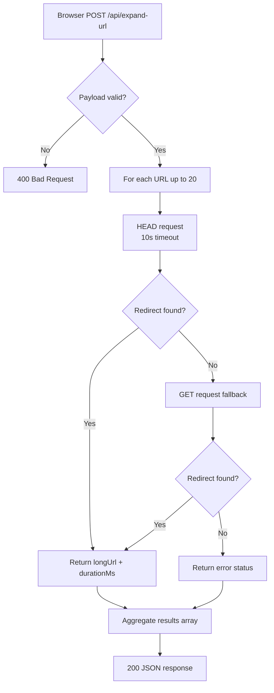

# Architecture

Live at **https://mopplications.com**

---

## Overview

Dev Toolkit is a **browser-first** developer utility suite. The architecture follows a single guiding constraint: **all tool logic runs on the client; the server exists only to serve the Next.js app and proxy redirect-following for the URL Expander.**

```
Browser                             Server (Node 20)
──────────────────────────          ──────────────────────────────
All tool state (localStorage)  ←→  Next.js App Router (standalone)
All tool computation                /api/expand-url  ← only server-side logic
Dark/light theme persistence        Middleware: CSP nonce, security headers
```

---

## Stack

| Layer | Technology | Notes |
|---|---|---|
| Framework | Next.js 15 (App Router) | `output: "standalone"` for Docker |
| Language | TypeScript (strict) | |
| Styling | Tailwind CSS v3 | Custom HSL design tokens, dark mode via `.dark` class |
| UI primitives | shadcn/ui (Radix) | Button, Input, Label, Textarea |
| Icons | lucide-react | |
| Rich text | Tiptap v3 (ProseMirror) | CSP-safe, no eval |
| Search | Fuse.js v7 | Fuzzy search across tool titles and tags |
| State | React `useState` / `useReducer` | No global state manager |
| Persistence | `localStorage` only | No database, no sessions |
| Package manager | pnpm | Strict lockfile (`--frozen-lockfile` in CI) |
| Testing | Vitest + @testing-library/react | jsdom environment |

---

## Directory structure

```
/
├── app/
│   ├── layout.tsx              Global HTML shell — ThemeProvider, anti-FOUC nonce script
│   ├── page.tsx                Homepage — hero, ToolGallery (sorted A–Z), footer
│   ├── not-found.tsx           Custom 404
│   ├── robots.ts               Auto-generated robots.txt
│   ├── sitemap.ts              Auto-generated sitemap.xml (all tool slugs)
│   └── api/
│       └── expand-url/
│           └── route.ts        POST — server-side URL redirect follower
│   └── tools/
│       └── [slug]/
│           └── page.tsx        Dynamic route — renders any registered tool
│
├── components/
│   ├── ThemeProvider.tsx        React context + localStorage for dark/light mode
│   ├── ThemeToggle.tsx          Fixed top-right Sun/Moon button
│   ├── ToolCard.tsx             Card tile shown on homepage grid
│   ├── ToolGallery.tsx          Client component — Fuse.js search + tag filtering
│   ├── ToolShell.tsx            Wrapper for individual tool pages (back link, title, card)
│   ├── tools/                   One file per tool (lazy-loaded, "use client")
│   │   ├── Base64Utility.tsx
│   │   ├── BasicCalculator.tsx
│   │   ├── CompareTools.tsx
│   │   ├── EditorPad.tsx
│   │   ├── JsonTools.tsx
│   │   ├── JsonViewer.tsx       Sub-component used by JsonTools
│   │   ├── JwtGenerator.tsx
│   │   ├── PasswordGenerator.tsx
│   │   ├── QrCodeGenerator.tsx
│   │   ├── RegexTester.tsx
│   │   ├── TimestampConverter.tsx
│   │   ├── UrlEncoderDecoder.tsx
│   │   ├── UrlExpander.tsx
│   │   └── UuidGenerator.tsx
│   └── ui/                      shadcn/ui primitives
│       ├── button.tsx
│       ├── input.tsx
│       ├── label.tsx
│       └── textarea.tsx
│
├── lib/
│   ├── tools.config.ts          Single source of truth for all tools
│   ├── search.ts                Fuse.js wrapper with memoised index
│   ├── base64.ts                Pure encode/decode utilities
│   ├── jwt.ts                   HS256 JWT sign/verify (browser SubtleCrypto)
│   └── utils.ts                 Tailwind cn() helper
│
├── styles/
│   └── globals.css              Tailwind base + HSL tokens + Tiptap ProseMirror styles
│
├── tests/
│   ├── setup.ts                 Vitest global setup (next/image mock, cleanup)
│   └── tools/                   Per-tool regression tests (13 files, 61+ tests)
│
├── middleware.ts                 CSP nonce generation + security response headers
├── next.config.ts                standalone output, esmExternals
├── Dockerfile                    Multi-stage build (deps → builder → runner)
└── Jenkinsfile                   CI/CD pipeline (build → push → deploy)
```

---

## Tool registry

All tools are registered once in `lib/tools.config.ts`. Adding a tool requires zero changes to routing, sitemap, or search.

| Slug | Component | Server-side? |
|---|---|---|
| `base64-tool` | Base64Utility | No |
| `basic-calculator` | BasicCalculator | No |
| `compare-tools` | CompareTools | No |
| `editor-pad` | EditorPad | No |
| `json-tools` | JsonTools | No |
| `jwt-generator` | JwtGenerator | No |
| `password-generator` | PasswordGenerator | No |
| `qr-code-generator` | QrCodeGenerator | No |
| `regex-tester` | RegexTester | No |
| `short-url-expander` | UrlExpander | **Yes** — proxies via `/api/expand-url` |
| `timestamp-converter` | TimestampConverter | No |
| `url-encoder-decoder` | UrlEncoderDecoder | No |
| `uuid-generator` | UuidGenerator | No |

---

## Request lifecycle

### Homepage

```
Browser → GET /
  → Next.js RSC renders page.tsx
    → toolSummaries (static, sorted A–Z) passed to ToolGallery
      → ToolGallery hydrates client-side
        → Fuse.js index built in memory
        → User types → fuzzy search → re-render cards
```

### Tool page

```
Browser → GET /tools/editor-pad
  → middleware.ts runs first
    → generates nonce
    → attaches CSP + security headers
  → Next.js renders [slug]/page.tsx (RSC)
    → getToolBySlug("editor-pad") → lazy import EditorPad
    → EditorPad hydrates client-side
      → reads localStorage ("editorpad-notes", "editorpad-active")
      → Tiptap editor initialised with immediatelyRender: false (SSR-safe)
```

### URL Expander (only server-side tool)

```
Browser → POST /api/expand-url  { urls: ["https://bit.ly/xyz"] }
  → middleware.ts (CSP headers)
  → route.ts (server)
    → HEAD request to short URL with timeout (10s)
    → falls back to GET if HEAD fails
    → returns { shortUrl, longUrl, status, durationMs }
  → Browser displays expanded URL
```

---

## Security model

All handled in `middleware.ts` which runs on **every non-static request**.

| Header | Value | Purpose |
|---|---|---|
| `Content-Security-Policy` | nonce-based, strict-dynamic | Prevents XSS |
| `X-Frame-Options` | DENY | Prevents clickjacking |
| `X-Content-Type-Options` | nosniff | Prevents MIME sniffing |
| `Referrer-Policy` | strict-origin-when-cross-origin | Limits referrer leakage |
| `Permissions-Policy` | camera=(), microphone=(), geolocation=() | Disables sensitive APIs |

**Production CSP (strict):**
```
script-src 'nonce-<random>' 'strict-dynamic'
connect-src 'self'
```

**Dev CSP (relaxed for HMR):**
```
script-src 'self' 'nonce-<random>' 'strict-dynamic' 'unsafe-eval'
connect-src 'self' ws: wss:
```

---

## Data flow diagrams

### Homepage search



### Tool page rendering



### EditorPad state machine



### URL Expander server flow



---

## Key architectural decisions

| Decision | Rationale |
|---|---|
| All tools run in the browser | Zero server costs for compute; no data leaves user's machine |
| Single `tools.config.ts` registry | One place to add/remove tools; routing, sitemap, search all auto-update |
| Tiptap v3 for rich text | ProseMirror-based, CSP-safe (no eval), MIT licence, table support |
| `output: standalone` | Minimal Docker image — only ships the Node server + `.next/standalone` |
| Nonce-based CSP over hash-based | Per-request nonces are immune to static analysis attacks; compatible with `'strict-dynamic'` |
| localStorage only | No auth, no server persistence, no GDPR surface; works offline |
| Fuse.js threshold 0.35 | Balanced between precision (avoid false positives) and recall (typo tolerance) |
