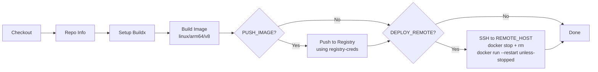
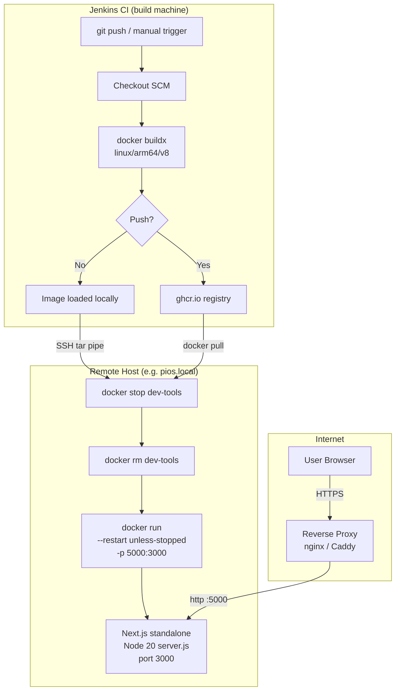

# Deployment

This project ships as a **Docker container** built by a **Jenkins CI/CD pipeline** and deployed to a remote host (default: `pios.local` — a Raspberry Pi or similar ARM device).

---

## Container architecture

```
Dockerfile (multi-stage)
├── base      node:20-alpine + pnpm via corepack
├── deps      pnpm install --frozen-lockfile
├── builder   next build  (standalone output)
└── runner    node server.js  (port 3000)
```

`next.config.ts` sets `output: "standalone"` — the runner image ships only what is needed (`server.js`, `.next/standalone`, `.next/static`, `public/`). No `node_modules` in the final image.

**Target platform:** `linux/arm64/v8` (Raspberry Pi 4/5, Apple Silicon servers). Change `--platform` in the Jenkinsfile `Build Image` stage for x86.

> Security headers (CSP, X-Frame-Options, etc.) are enforced by `middleware.ts` at the application layer — no additional nginx/proxy security config is needed for headers. → See [docs/ARCHITECTURE.md — Security model](ARCHITECTURE.md#security-model) for the full header table.

---

## Environment variables

| Variable | Required | Default | Description |
|---|---|---|---|
| `NEXT_PUBLIC_SITE_URL` | Yes | `https://mopplications.com` | Canonical base URL for metadata and Open Graph |
| `NODE_ENV` | Auto | `production` | Set by runner stage in Dockerfile |
| `NEXT_TELEMETRY_DISABLED` | Auto | `1` | Disables Next.js telemetry in all stages |

> `NEXT_PUBLIC_*` variables are baked into the JS bundle at **build time**. Changing them requires a rebuild.

---

## Jenkins pipeline

File: `Jenkinsfile`

### Pipeline parameters

| Parameter | Type | Default | Description |
|---|---|---|---|
| `SITE_URL` | string | `https://mopplications.com` | Sets `NEXT_PUBLIC_SITE_URL` at build time |
| `IMAGE_NAME` | string | `ghcr.io/your-org/dev-tools` | Full image reference (registry/namespace/repo) |
| `PUSH_IMAGE` | boolean | `false` | Push built image to registry |
| `DEPLOY_REMOTE` | boolean | `false` | SSH + deploy to remote Docker host |
| `REMOTE_HOST` | string | `pios.local` | Hostname or IP of target machine |
| `REMOTE_APP_NAME` | string | `dev-tools` | Docker container name on remote |
| `REMOTE_PORT_MAPPING` | string | `5000:3000` | `<host>:<container>` port mapping |
| `REMOTE_ENV_VARS` | string | `-e NEXT_PUBLIC_SITE_URL=...` | Extra env flags for `docker run` |
| `REMOTE_USERNAME` | string | — | SSH username |
| `REMOTE_PASSWORD` | password | — | SSH password |

### Pipeline stages



### Credentials required in Jenkins

| ID | Type | Used by |
|---|---|---|
| `registry-creds` | Username/Password | Push Image stage (docker login) |
| `REMOTE_USERNAME` / `REMOTE_PASSWORD` | Pipeline parameters | Deploy Remote stage (SSH) |

---

## Manual build & run (no Jenkins)

### Build

```bash
docker buildx build \
  --platform linux/arm64/v8 \
  --build-arg NEXT_PUBLIC_SITE_URL=https://mopplications.com \
  --tag dev-tools:latest \
  --load \
  .
```

For x86/amd64 hosts:
```bash
docker buildx build \
  --platform linux/amd64 \
  --build-arg NEXT_PUBLIC_SITE_URL=https://mopplications.com \
  --tag dev-tools:latest \
  --load \
  .
```

### Run

```bash
docker run -d \
  --name dev-tools \
  --restart unless-stopped \
  -p 5000:3000 \
  -e NEXT_PUBLIC_SITE_URL=https://mopplications.com \
  dev-tools:latest
```

App is available at `http://<host>:5000`.

---

## Deployment architecture diagram



---

## Reverse proxy (recommended)

The container exposes port `3000` internally (mapped to `5000` by default). Place a reverse proxy in front for HTTPS termination.

### Caddy example

```caddyfile
mopplications.com {
    reverse_proxy localhost:5000
}
```

Caddy auto-provisions TLS via Let's Encrypt.

### nginx example

```nginx
server {
    listen 80;
    server_name mopplications.com;
    return 301 https://$host$request_uri;
}

server {
    listen 443 ssl;
    server_name mopplications.com;

    ssl_certificate     /etc/letsencrypt/live/mopplications.com/fullchain.pem;
    ssl_certificate_key /etc/letsencrypt/live/mopplications.com/privkey.pem;

    location / {
        proxy_pass         http://localhost:5000;
        proxy_http_version 1.1;
        proxy_set_header   Upgrade $http_upgrade;
        proxy_set_header   Connection 'upgrade';
        proxy_set_header   Host $host;
        proxy_set_header   X-Real-IP $remote_addr;
        proxy_cache_bypass $http_upgrade;
    }
}
```

---

## Health check

```bash
curl -sf http://localhost:5000 | head -c 200
# Should return the HTML of the homepage
```

---

## Updating the deployment

1. Push changes to `main`.
2. Trigger Jenkins pipeline (`PUSH_IMAGE=true`, `DEPLOY_REMOTE=true`).
3. Jenkins rebuilds the image, SSHes to the remote host, stops the old container, starts the new one.
4. Zero downtime between stop and start is ~1–2 seconds (Node cold start on arm64).

For zero-downtime rolling deploys, use Docker Compose with a secondary container + Caddy upstream swap, or Kubernetes. These are out of scope for the current setup.
